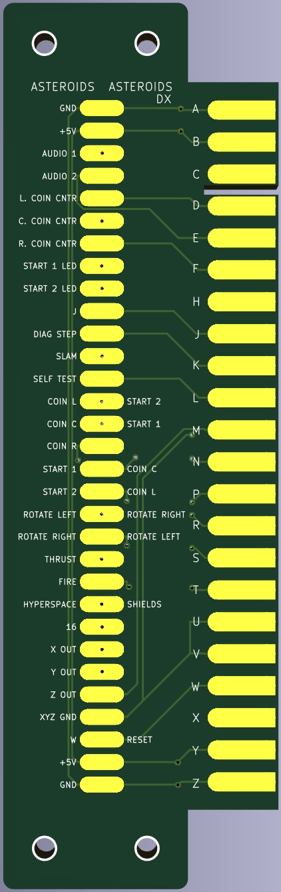
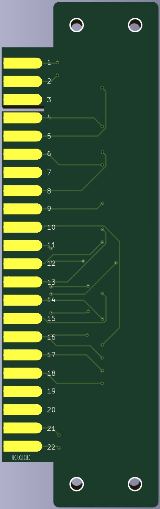

# Asteroids / DX Fingerboard

Owners of an original Asteroids or Asteroids Deluxe Cabinet may want to connect something like v.st or similar in their unmodified device.
This fingerboard is combatible with either harness and has the pinout for both printed on the silkscreen layer.
There are four 2.5mm mounting holes.

Additional notes:
- Recommended PCB thickness: 1.6mm
- **For JLCPCB**: Set the option 'Remove Order Number' to 'Specify a location' and the order number will be hidden under the Edge connector on the back.

